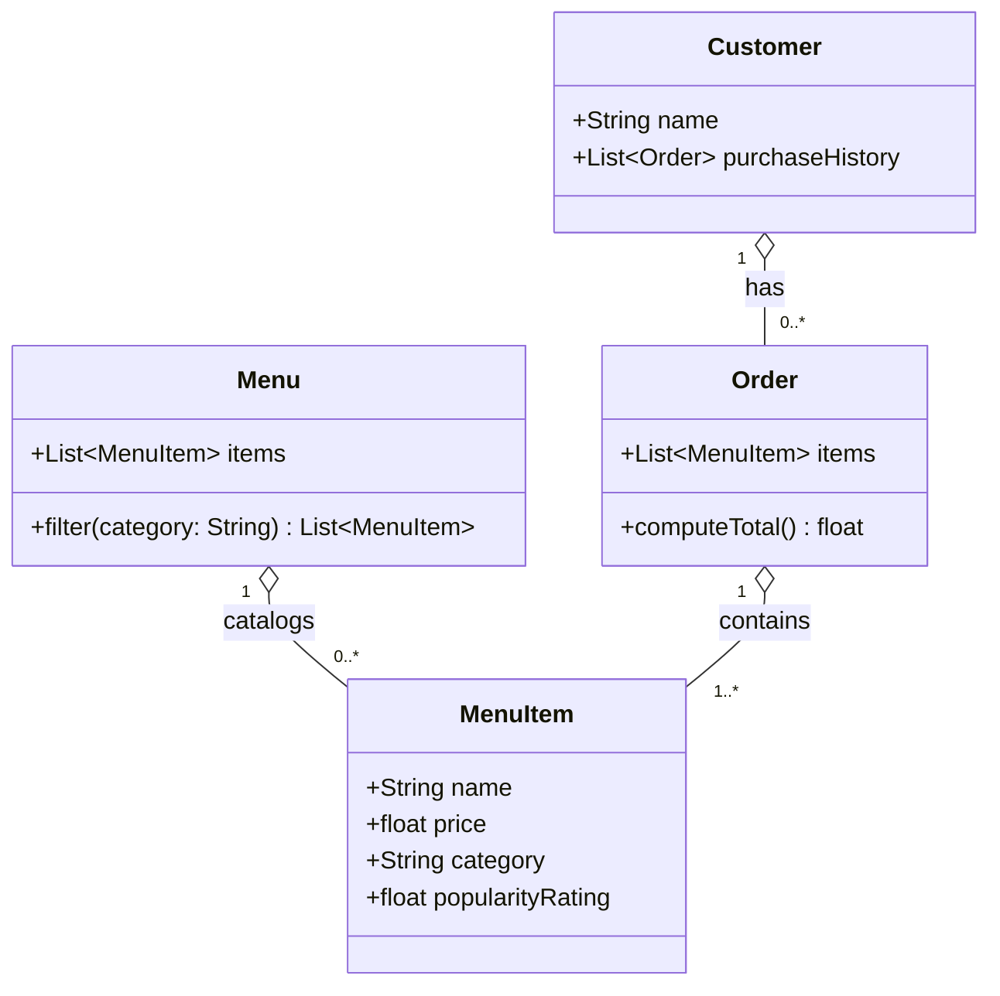

```mermaid
classDiagram
class Customer {
+String name
+List~Order~ purchaseHistory
}

    class MenuItem {
        +String name
        +float price
        +String category
        +float popularityRating
    }

    class Menu {
        +List~MenuItem~ items
        +filter(category: String) List~MenuItem~
    }

    class Order {
        +List~MenuItem~ items
        +computeTotal() float
    }

    Customer "1" o-- "0..*" Order : has
    Menu "1" o-- "0..*" MenuItem : catalogs
    Order "1" o-- "1..*" MenuItem : contains
```
