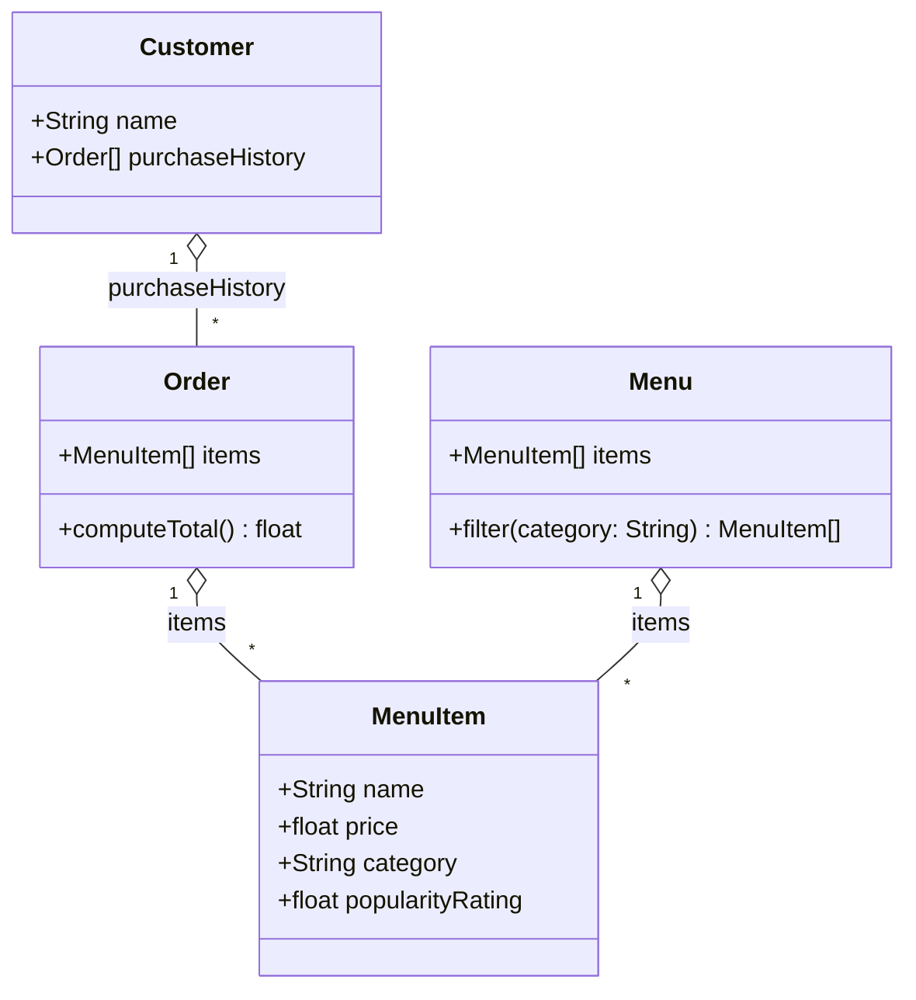

## Class Diagram

```mermaid
classDiagram
    class Customer {
        +String name
        +Order[] purchaseHistory
    }

    class MenuItem {
        +String name
        +float price
        +String category
        +float popularityRating
    }

    class Menu {
        +MenuItem[] items
        +filter(category: String) MenuItem[]
    }

    class Order {
        +MenuItem[] items
        +computeTotal() float
    }

    Customer "1" o-- "*" Order : purchaseHistory
    Order "1" o-- "*" MenuItem : items
    Menu "1" o-- "*" MenuItem : items
```
